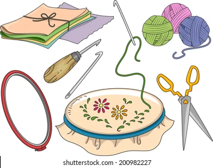
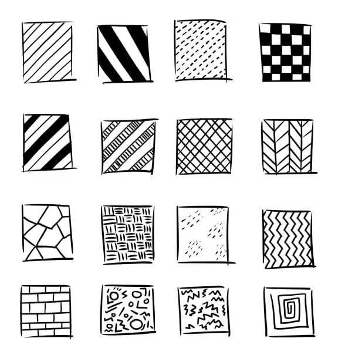

*Design Patterns as do arts and crafts differ from each other* 

When creating unique aspects similar to arts and crafts, there are sequential steps and aesthetics that lead to a product to be differentiated by the rest. Although there may be a difference, the foundation remains the same with some notable differences based on the person. In particular in software development, there are patterns that are integrated into practice as the basis to start from and are noted as “design patterns”, or object oriented design patterns. 

## Patterns that makes things unique

These design patterns assist in developing a framework in how classes interact with each other and provide a skillset of when to apply the pattern and solutions. There are several types of patterns that are included such as the creational pattern that creates objects, structural patterns that explain how to represent collections of objects, and behavioral patterns to explain how to manage the interaction between objects. The foundational concepts allow for individuals to understand the foreground of what's supposed to occur. However, there are also consequences to the implementations and usages of patterns based on intent, since patterns may be more suited for some implications than others. 

When considering the application of these patterns, it has been an important asset in the creation of programs that are functional for the user and the developer. There are typically several design patterns incorporated into projects to assist in preventing pitfalls in each of the frameworks. In the experiences that were personally encountered, the frameworks in place were an unconscious aspect that are typically “hidden behind the curtains” and were not directly noticeable or intuitive throughout. An example of the design pattern is “observer” where there is considered to be an object that notifies dependents and updates the state automatically, while maintaining the list. These changes can be observed in the design pattern “publish-subscribe” that is used in the backend for the implication of a template called [meteor application template react](https://github.com/ics-software-engineering/meteor-application-template-react). This template is used as the foundation for the development of websites that integrate javascript on the client and server side of the website. In this template it uses the “publish-subscribe” pattern for when there is a publication that when a collection is updated or created, then a meteor publication of the material, that leads to it going through a process to become subscription that leads it to be read and be present in the user interface. This design pattern allows for the integration of process and understanding of what is to come next, how things are updated and the sequential order that needs to occur. 

## Passing Down Knowledge to Sustain

 These design patterns are essential to the foundation in ensuring that all elements collaborate effectively. These processes often during the time of writing/ creation are optimal and there is a shared understanding amongst developers. Over time, as time progresses and there is the lack of knowledge, it leads to people not being aware of what is needed to maintain the system and rather leads people to either redo the system completely or not wanting to change it in fear that the entire system will break. Thus, the design patterns are useful in assisting to maintain the system and understand the flow of information through it/ how to do things. The power of design patterns is built on the foundation of the continuation of knowledge from one developer to another, so that it can continue to be maintained and not discarded or redone. 
