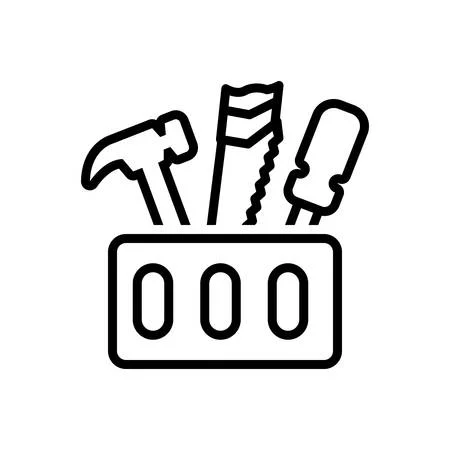

*We live and We learn*

## Learning can be applied everywhere

In all things that are executed, done, or completed, there are always life lessons or lessons learned that can be applied to other cases and serve as a life lesson. Without learning through experience or research, it leads to an individual to not be equipped with knowledge of precedent on a way things should be conducted or without the knowledge of mistakes that happened in the past and how to aid in avoiding such occurrences. 

## Software Engineering part of a tool set

When learning about software development through a systematic engineering approach known as software engineering with an emphasis on web application development, there are broader concepts that can be appropriated towards other utilizations. These skill sets are valuable in collaborating and ensuring a process is maintained as collaborators join or transition onto the team to continue processes. By having the base knowledge of these processes such as Agile Project Management, Configuration Management and Ethics in Software Engineering, it assists in getting an idea of what is needed to ensure that there is consistency and understanding of what aspects need to be considered. 

## Breaking down overarching ideas into pieces  

The process of breaking down a project into smaller sequences and creating several overarching sequences or incremental steps towards the completion of a project are known as Agile Project Management. Through this process it ensures that the different aspects are done in the most efficient and effective timeline. This process assists in understanding how to break down problems into smaller issues so that there is a coherent understanding of the different aspects that are needed to be addressed and completed in order for there to be an effective and efficient result. Thus, as a tool, the issue driven project management is essential to understanding the expectations of what is needed for each step along with understanding what everyone is currently working on so that there is effective collaboration between the different individuals who are collaborating on a project. These processes, in terms of website development, enable everyone on the team to be aware of the different moving parts such as creating web pages and portions of the server to launch the application. Understanding who's working on which protons as tasks and the assurance/ understanding of what needs to be done allows for the continuity of work flow amongst everyone on the team. Thus, this concept can be applied to other projects outside of website development, in understanding how to break down a problem and understanding how there are crucial elements/ people/ tasks that need to be completed. This will allow for the assurance that everything will be done in an efficient and effective manner and that everyone continues collaborating in unison towards the end goal. 

## Convention as a necessity

To continue to promote collaboration, there are conventions that are necessary to follow so that there is a clear and cohesive understanding with minimal confusion. The idea of a continuous process of the maintenance of standards is known as Configuration Management. Through this process, in terms of website development, it allows for and promotes a sense of continuity and understanding amongst all team members, where everyone is following a similar coding standard that is implemented amongst all platforms. This process ensures that there are minimal issues in rendering and understanding what is happening in code across devices or coding environments. The practice of configuration management can be applied to practices outside of website development. When working on projects with collaborators, the usage of similar configurations allows for increased collaboration in running the different aspects of a project where everything is continued in unison. Configuration management principles allow for projects that relate to code, the ability to be able to work on different development environments (i.e, on different computers) and continue to get the same result. Thus, configuration management is essential to all practices in allowing for the ability for multiple to contribute in an effective and efficient manner. 

## Staying true to oneself

There is importance in continuously working efficiently and effectively to break down bigger problems into smaller issues while ensuring that there is the continuous integration of understanding amongst all stakeholders. It is also important to remember an individual's foundations. By exploring the foundations of ethics known as an individual's moral principles that are directed to an individual's right choice in terms of software engineering, it allows for the identification that despite being assigned to complete a certain task or project, it is important for a person to stay grounded in their beliefs of application of what is right and what is wrong. In the exploration of ethics in software engineering, it brings about the scenarios of where a piece of software is beneficial to some stakeholders while serving as a disservice to others. There are particular instances where individuals create code that's for a project and regret it thereafter. This can be directly seen in the article by BIll Sourour (2016) titled  “The code I’m still ashamed of” where he was assigned to make code to generate a prescription medication targeted towards young girls. Upon going to a dinner, Sourour heard that there was a young girl who died of suicide after taking the perscription due to suicidal and depression after effects of the drug. Sourour then realized the ramifications of the project and that his sister was taking it too. Thus, leading him to tell her to no longer take it and resign from the position. The code he created was something that he was ashamed of and could not take back. It is, therefore, necessary for the person in charge of the tasks to understand their individual merit, worth, value and personal opinion to evaluate whether creating the piece of software would be beneficial or an atrocity in their opinion. More broadly it can be applied to places an individual chooses to work at or the types of projects an individual would work on. It is an individual's responsibility to determine whether she/he wants to be part of change to implement it in a more ethical manner or step away since it does not align with the moral standards that they hold. Understanding the consequences and role an individual plays as a stakeholder and for the company, it  allows individuals to understand the idea of individual fulfillment and satisfaction.

*Lifelong learners*

## Applying lessons through continous growth

By understanding the broader applications of these frameworks and ideas, it allows for the continuous growth and development as a person. There are multiple principles and ideas that can be processed across disciplines, projects and atmospheres. By applying these principles and concepts to ideas beyond the direct application of software engineering with an emphasis on web development, it allows for the growth of an individual person and understanding of what practices could be implemented to be able to sustainably operate as a team, and preserve the customers mission/ vision while continuously integrate collaboration while also staying true to one’s morals and principles.  
