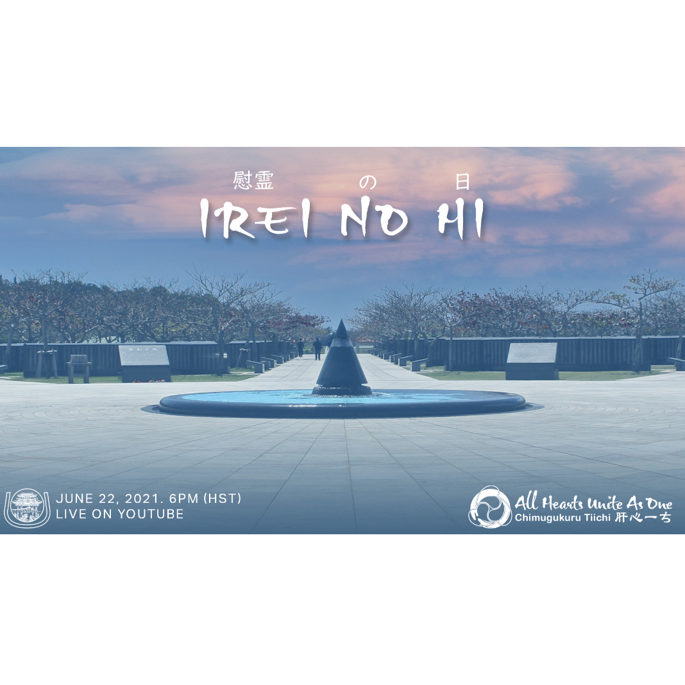

Irei No Hi is known as Okinawa's Memorial Day that pays tribute to the civilian hardships and lives lost during the Battle of Okinawa in World War II. In 2021, I volunteered and co-chaired the production of a video of about 2 hours for the Hawaii United Okinawa Association (HUOA) for Hawaii’s tribute. This tribute is usually put on by 40 - 50 year olds, however I co-led a team of 6 college-aged individuals in creating this tribute. I served as the co-chair with Jacob Higa and our committee members were Madi Miyashiro, Kyra Pila, Cheyne Tanoue and Cody Kaneshiro. The advisors who oversaw this project were Gwen Fujie, 2021 HUOA President Patrick Miyashiro, 2021 HUOA Vice President Eric Nitta, 2021 HUOA President Elect David Jones, and HUOA Executive Director Jon Itomura. 

During this process, I participated in various roles. In the beginning, I partook in facilitating discussions about the theme of our video about how it was our time to make it unique to the younger generation. Through these discussions and the whole process, I was able to learn how a strong foundation in the general idea is able to shape the idea behind the whole project. I assisted in the coordination of meetings with the advisors to ensure that the video would be the quality that was expected. During these meetings, I learned the importance of having advisors to help ensure that the message and image were aligned with the organization's efforts. The Hawaii United Okinawa Association has 50 member clubs that consists of hundreds of members and has been established in the islands since 1951. The feedback that was provided was crucial in the development of every aspect to ensure that it was well represented. The decision was then to proceed with shaping it around us, the younger generation who was putting together the video and talk about the impact that it had on us and make it relevant to our generation.

I created the Google form to find survivors from the Battle of Okinawa which was distributed by the Hawaii United Okinawa Association and the University of Hawaii Center for Okinawan Studies. Through this I learned the importance of knowing the different options there were and where to send it to since by sending it through the Center of Okinawan Studies we were able to get more responses from survivors or researchers wanting to document their stories. Following the sign up, I then started to contact the survivors on behalf of HUOA to begin setting up interview times and dates along with collecting background information for the survivors to generate questions for the interviews. 

There were multiple survivors that responded to the survey along with the researchers who wanted to share their research. Due to time constraints, I facilitated a discussion about how we wanted to phrase our video and what was most important. Then, there was the decision to focus on sharing the survivors' stories and bringing out the importance of each video. I helped and facilitated the development of questions to ensure that the questions were simple and easy to answer questions about their experiences. From this, I learned the importance of ethics and the representation that although I and my committee members were college students, we represented an organization that has thousands of members so the questions that were asked were not only for the interview, but also to represent the community. I helped draft the questions and then found the importance of sending it to the advisors before proceeding to ensure that each question aligned with HUOA and that it was reasonable. 

During the interviews that were conducted, I learned the importance of listening to stories, since these stories were not stories that could be found in history books, but were  stories that only could be heard from the survivors themselves. Something that struck me is that although these people are elders, during the battle of Okinawa they were either around college age or younger, and it completely amazed me that despite their age, they remembered these traumatic events. It made my committee and I realize how important it was to continue to talk about these stories and to relay it to the younger generation. 

Following all the interviews, I realized that I did not remember all that was said in the interviews and needed to watch the interviews again to see what information to pick out. Therefore, I transcribed about 8-10 hours of interviews to see all the information that was present, where about half was in Japanese/ Uchinanguchi (Okinawan) and, therefore, leading for my friend, Maya Murata and I to transcribe and translate the non English interviews. From this I learned the importance of listening to every single aspect and documenting it so that it could be looked back on to see how it would fit into the overall interview. From this process, it also made me realize how much information was retained with the traumatic stories, but also how details told later on by relatives such as specific numbers of casualties were able to add a different meaning to the experiences. After reviewing the interviews, I realized the importance of making sure that the interview's sound quality was reasonable and ensuring that the interviewees sounded all right since it would be broadcasted on YouTube and Facebook. Through this, I was able to learn that although as co-chair of the project, it was not a simple school project that represented myself and a group, it also represented an organization and my family who have been heavily involved in the community. Some interviews had to be redone, although more time was important to protect the interviewees' rapport with the organization and everything that the organization/ committee meant. 

While the interviews were going on, I also led the effort in doing the research of the Battle of Okinawa, so that going into the interviews we would be aware of what the Battle was about, so that it would be more impactful and we could understand the situation at the time and ask more relevant questions to bring out the stories. From my publication background, I learned that to make the information universally understandable it was important to put an introduction to bring relevance to the Battle of Okinawa, so I drafted and finalized the introduction portion. From this, I learned the importance of an introduction since although older people within the Okinawan community were aware of the Battle, the details are not always shared, so it was important to bring out all the details of the Battle. 
Following the transcribing of the interviews, I picked out the most impactful interview clips to use and put the relevant ones near each other along with creating a meaningful discussion about each topic to bring the story together. From this I learned the importance of how everything needs to flow similar to an essay where everything needs to build on top of each other along with how each word is important and how important it was to consider the reputation and stance of HUOA in every word that was said by the survivor and during the discussion.

Once everything was completed, I helped review the video before going live and solicited feedback to ensure that everything was correct/ up to expectations. Then it had its world premiere on July 21,2022, where the video now has over 2 thousand views on YouTube and Facebook combined and is being shown to students in Okinawa by their teachers. By being a part of this project, it served as an example to the Okinawan community that despite being generations away from immigration and engrossed in other activities, that we still continue to want to perpetuate and preserve the Okinawan culture for generations to come. 

During this process, I ensured that the project was kept on track, and more importantly it taught me the importance of time management, organization and having a calendar of dates set out to ensure everything was completed to the best quality that could be produced. 

[YouTube Link](https://www.youtube.com/watch?v=wAMbctKWp7A) 
  

