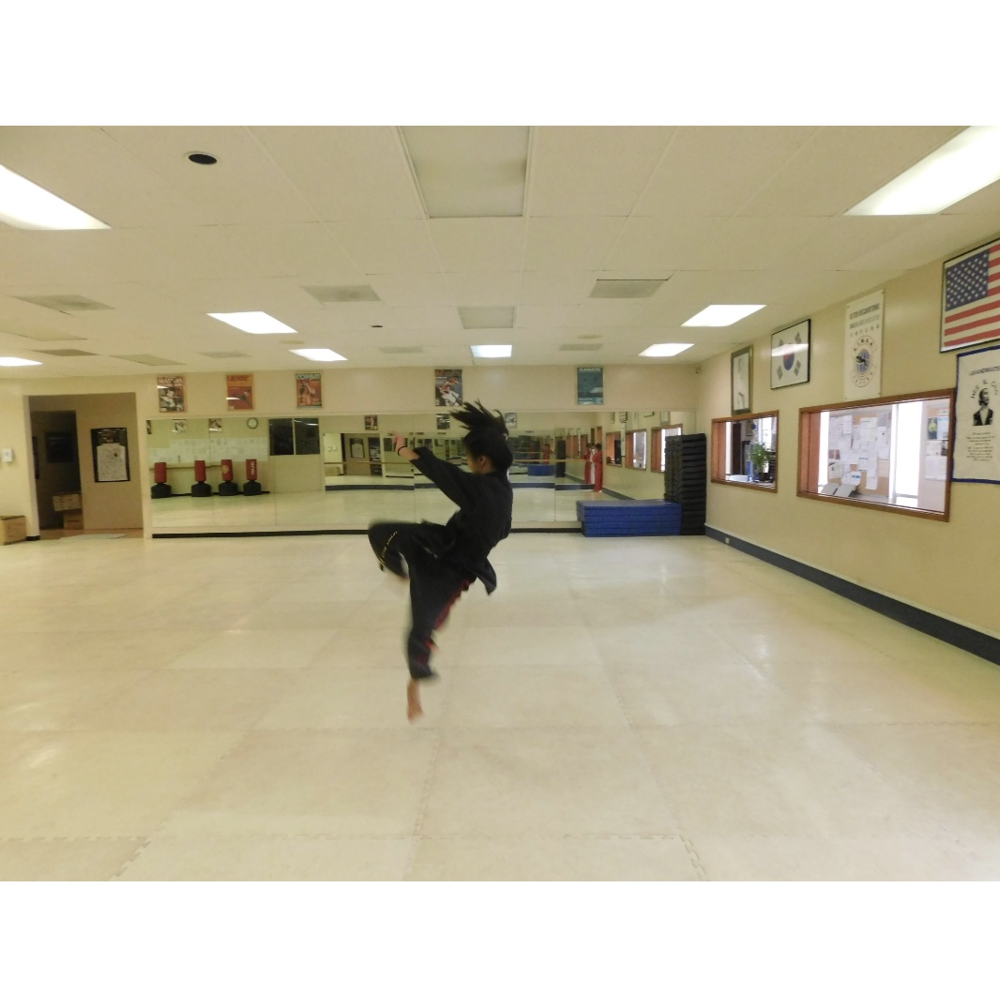

I have been fortunate to be able to train under Grandmaster Hee Il Cho and attain my second degree black belt. Through this journey, I have not only learned martial arts, but have learned how to be a martial artist. I have been able to learn and start to develop morals that strive to bring a sense of understanding for things greater than myself. I have learned and continue to learn the principles of discipline, modesty, courtesy, integrity, self-control, perseverance, indomitable spirit, respect, and several others stemming from respecting people and the environment. I have been fortunate to be exposed to these principles and they have helped to shape my life, since the day I started Tae Kwon Do. 

During my time in Tae Kwon Do, I aimed to attend classes 6 days a week for an hour of class, and possibly 1-2 hours assisting the younger students. From attending class and assisting in classes, I was able to learn leadership skills and how to identify issues, and more importantly learn how to teach to fix them during class. There were times when I led a class of 60 students in stretching and taught younger students in groups of 20 people their patterns. From this experience, I learned the sense of serving as a role model for other people to follow and learn how to think of routines and possibilities on the fly to continue to make the class moving since when called upon to lead it was never planned. By being in the position of assistant instructor it made me have the courage to call on people to motivate them to try harder and also determine which people to demonstrate. 

I also served as a testing judge on testing days when I had a group of students where I would be critiquing their performance and providing feedback on the techniques. Through this experience, I learned how to provide critical feedback and how to examine things in detail. While also realizing based on the amount of time a person dedicates to the skill, it leads to further refinement and precision. I also was able to learn the importance of instructors and role models since in class we stand in ranking order and this leads for people in the back to follow and make inferences. Thus corrections need to be made early to ensure proper understanding. Therefore, from this experience I have been able to learn how to critique, give constructive feedback and also learn how I can improve my teaching to help the students. 

When studying Tae Kwon Do, I studied under the organization called AIMAA standing for Action International Martial Arts Association. The curriculum of this organization is rooted in not only learning how to defend yourself but also learning how to develop into a better person grounded in morals as mentioned earlier and development of memory and understanding. For each testing we were required to be able to answer a set of questions for our belt along with questions from the previous belts from memory. For each belt, there was a paragraph definition to memorize about the hardships the Koreans went through and the significance of the pattern that was being done. Therefore, by my second degree black belt testing I was to memorize around 12 meanings of patterns word for word and several other passages word for word, where if I messed up any word, everyone knew. This experience taught me grit and endurance to learn how to memorize every word no matter how much practice it took.  It taught me the importance of time management and the need for deeper understanding to ensure that everything was memorized perfectly, along with discipline to make myself study despite not wanting to. 

During testing for my upper belts, I tested by myself where all the other testers were watching me, and the only people moving and speaking were my head instructor and myself. Through this experience, it taught me how to be fearless in front of a group despite the pressure and taught me that although there was pressure, it was important to maintain my intuition and memory. 

Through Tae Kwon Do, I have been able to learn to remain humble and understand the more holistic approach to things and deciding what would be best not only for myself but for others. My Tae Kwon Do journey has and will continue to make an impact on my life. I continue to aspire into becoming a better martial artist. 

