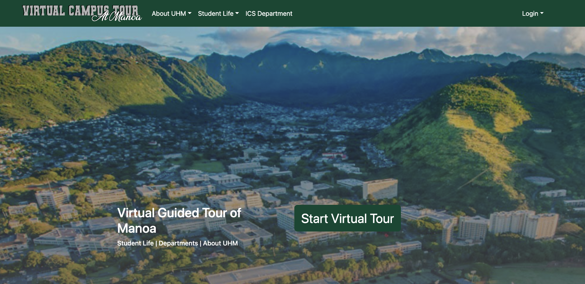

[Link to Project Page](https://virtual-campus-tour.github.io/)

# Why a virtual campus tour for the University of Hawaii at Manoa

The University of Hawaii at Manoa (UHM) has undergraduate and graduate degree programs. There are over 13,000 students who apply to attend the university each year, composed of students who are based on Oahu - where the university is located - along with outer island residents and mainland/international students. These students want to determine whether UHM is the best fit for their college experience and the way they do that is by visiting the campus in-person.

As of Fall 2022, UHM only has a YouTube video and a third party service that highlights buildings on campus that acts as the virtual campus tour. Since Hawaii is located far away from most other major colleges, prospective students have to make a choice to either visit locally situated colleges, or fly out to UHM to take an in-person tour of our campus. Thus, it would benefit UHM to create a virtual campus tour that provides more information about the college experience at UHM. As a team we decided that we wanted to make this tour based on the idea of it being ‘for students by students.’

In this project, my team and I developed several pages that encompassed the University of Hawaii at Manoa campus from the students life, athletics, academics, study areas and research with an emphasis on the Computer Science Department. Each of the pages that we created incorporated links to other University of Hawaii at Manoa pages. As a team, we plan to continue this project in the future to make it encompass the whole campus/ University of Hawaii system.

### What were my contributions

My contributions to this project consisted of: creating issues, updating the project board & project pages, merging branches, facilitating conversations/ meetings on direction of project, developing pages, and revising the content on pages such as the general page. 

The pages that I directly contributed to in the development process were: the study areas, campus center, athletics,  Pacific Ocean Science and Technology building page, the end of tour page, list clubs, add club and edit club pages. These pages assist users in becoming familiar with the University of Hawaii at Manoa campus.

[Link to GitHub repository](https://github.com/virtual-campus-tour/virtual-campus-tour)

### What I learned from this experience

From this experience, I learned the importance of the application design where creativity determines the quality of the piece of work. Along with ideas being discussed, the implementation by the developer and their creativity determines how it transverses to be quality. By integrating collaboration on ideas it allows for there to be transversal of expectations. I also learned the importance of having agile project management and the breaking of tasks into smaller pieces so that people are more inclined to work on it in a timely manner. 

I  importance of the application of concepts learned in class such as issue naming conventions, coding standards, and agile project management that allowed my team and I to succeed in creating our "beta project". Without the fundamental background of these ideas, it would have been more difficult to organize a project and continuously integrate our ideas and to create the more effective and efficient collaboration.

[Direct Link to Deployment/ website application](https://uh-virtual-campus-tour.xyz/)
